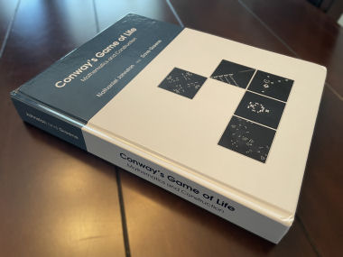
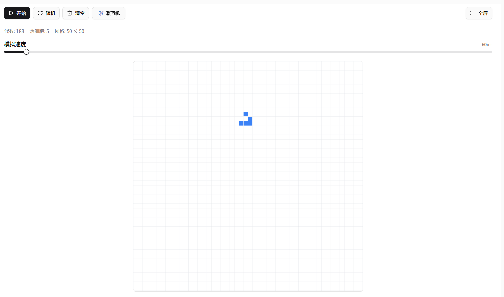

# 生命游戏题解
## 背景
这道题是这次比赛发布前的宣传中的题目。

这道题的康威生命游戏是可以无限拓展边界的，比起常见的不能拓展边界的，更有意思。
因为有一些经典的图案能够沿着水平垂直或者对角线传播，增大要处理的坐标。不过好在初始坐标范围和迭代次数都是1e2数量级的，最终坐标的范围不会超过2100？范围也是可控的。

比如下面的图案能够水平向右传播
```
000000000000000
001111000000000
010001000000000
000001000000000
010010000000000
000000000000000
```
下面的图像能够向右下方传播，这个图形甚至被一本康威声明游戏的专著[<<Conway's Game of Life
Mathematics and Construction>>](https://conwaylife.com/book/)放到了封面上,这本书可以免费下载电子版。
```
001000000000000
000100000000000
011100000000000
000000000000000
```



大家可以在网上找个在线模拟器玩一下，例如这个 https://lzj.ac.cn/tools/simulator/game-of-life




## 题解
我一开始只使用python修改conway.py文件。主要采用了numpy去替代原先的嵌套列表，用scipy对每个细胞做卷积，来计算出这个坐标周边八个点中存活细胞的数量。但是速度比较慢，差不多能拿50分的样子，离满分两百差的比较远。

不得不修改成cpp的版本，简单地把python程序翻译成cpp的就能获得很大的性能提升，好像能拿七八十分。

主要的优化点：

1.最主要的优化是使用了simd的优化。比如说处理`a[x][y]`到`a[x][y+15]`这十六个点。我取八次`char\*16`的向量，分别是`a[x][y]`的左上，上，右上，左，右，左下，下，右下为开头的`char\*16`的向量，让他们相加，就可以处理十六个点的存活邻居细胞数量。之后再用simd判断这个向量中哪几位和2相等、哪几位和3相等。
因为使用的是gcc的vector拓展而不是直接写intrinsic，所有能够在x86机器上跑。我在比赛提供的arm服务器上没办法成功加载python的pybind环境，调试不了，因此只能在自己的x86环境下测试。
```CPP
for (x = vec_start; x + 15 < vec_limit; x += 16) {
    // 上一行
    u8x16 tL = LZ(prow_m1, x - 1);
    u8x16 tC = LZ(prow_m1, x    );
    u8x16 tR = LZ(prow_m1, x + 1);
    // 本行（左右）
    u8x16 mL = L (prow,    x - 1);

    // 当前细胞（0/1）
    u8x16 alive = L(prow, x);

    u8x16 mR = L (prow,    x + 1);
    // 下一行
    u8x16 bL = LZ(prow_p1, x - 1);
    u8x16 bC = LZ(prow_p1, x    );
    u8x16 bR = LZ(prow_p1, x + 1);

    // 8 邻居求和（0..8）
    u8x16 sum = tL + tC;
    sum = sum + tR;
    sum = sum + mL;
    sum = sum + mR;
    sum = sum + bL;
    sum = sum + bC;
    sum = sum + bR;

    // 规则：s==3 || (s==2 && alive==1)
    u8x16 eq3 = (sum == V3);                 // 0xFF / 0x00
    u8x16 eq2 = (sum == V2);                 // 0xFF / 0x00
    u8x16 alive_mask = (alive == VONE);      // 0xFF / 0x00
    u8x16 mask = eq3 | (eq2 & alive_mask);

```


2.用来储存细胞存活或者死亡状态，只需要一个char就可以了，不需要用int,提高cache效率。可以在接口处把二维的int矩阵转化为二维的char矩阵，之后每次迭代的时候用二维的char矩阵来迭代。迭代完了再把结果转成二维int矩阵。
```CPP
// int -> char（更小带宽，提升 cache locality）
const int h0 = static_cast<int>(initial_grid.size());
const int w0 = (h0 > 0) ? static_cast<int>(initial_grid[0].size()) : 0;

std::vector<std::vector<char>> cur_char(h0, std::vector<char>(w0, 0));
for (int y = 0; y < h0; ++y) {
    const std::vector<int>& src = initial_grid[y];
    char* dst = cur_char[y].data();
    for (int x = 0; x < w0; ++x) dst[x] = static_cast<char>(src[x] != 0);
}
```

3.这道题虽然能用16个核心，但是用8个甚至四个核心的时候计算速度更快，可能是因为我的做法是访存密集型的负载。线程数多了可能会有带宽不够的情况，提高平均的延迟。

4.在测评的arm服务器环境下，分配16或者32字节对齐的内存来储存每次迭代的时候新建的矩阵，性能会比不字节对齐的内存好特别多。但是在我测试的x86环境下，性能差不多。

5.可以设置在矩阵大于一定程度的时候才使用openMP来多核并行，能有效提高后两个测试的分数。
```cpp
#pragma omp parallel for num_threads(NT) schedule(static,1) if(H*W >= 8192)
for (int t = 0; t < NT; ++t) {
...
}
```

6.这道题只能上传NG.cpp和conway.py两个文件，不能修改cpp文件的编译选项，可以在cpp文件头部加一些编译选项，提高运行速度
```cpp
#pragma GCC optimize("Ofast,no-stack-protector,fast-math")
#include <vector>
...
```
